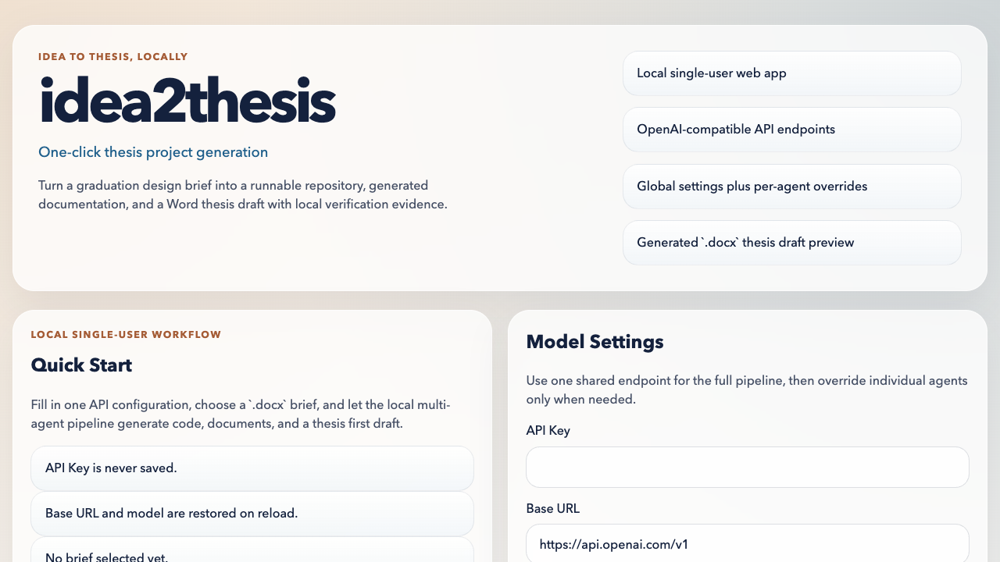
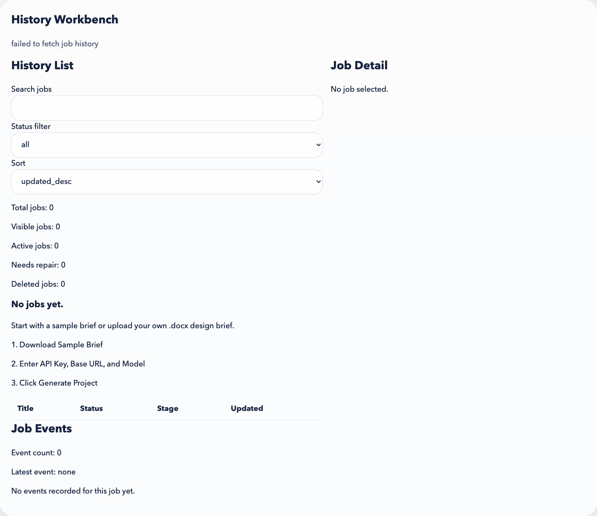
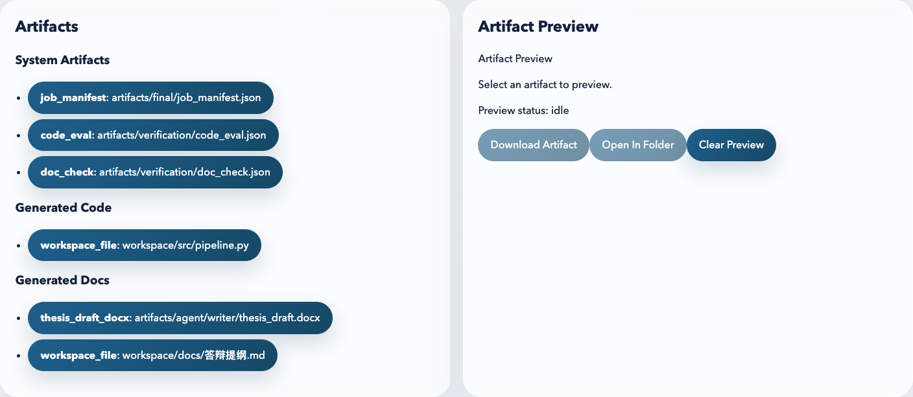

# idea2thesis

`idea2thesis` 是一个本地单用户 Web 应用。它接收一份 `Word (.docx)` 毕业论文设计书，然后在本机运行多 Agent 流水线，生成：

- 可运行的项目工作区
- 仓库文档
- 论文初稿
- 本地校验证据

项目定位很明确：

- 开源到 GitHub
- 用户自行本地部署
- 用户自己提供 `API Key` 和 `Base URL`
- 所有生成结果默认落在本机 `jobs/` 目录
- 不是托管 SaaS，也不是多人在线平台

English summary:

`idea2thesis` is a local single-user web app that turns a `.docx` graduation thesis brief into a generated repository workspace, project documents, a thesis first draft, and local verification evidence.

## 开源信息

- License: [Apache License 2.0](LICENSE)
- Contribution Guide: [CONTRIBUTING.md](CONTRIBUTING.md)
- Changelog: [CHANGELOG.md](CHANGELOG.md)
- Release Notes: [v0.1.0](docs/releases/v0.1.0.md)

## 当前产品状态

当前仓库已经具备这些核心能力：

- 本地前后端一键启动
- 上传 `.docx` 设计书后创建持久化任务
- 多 Agent 执行链路
- 任务历史工作台
- 任务详情、事件时间线、产物列表、产物预览
- 重新运行与软删除
- 工作区 ZIP 导出
- 默认中文界面
- 右上角一键切换英文
- 语言选择自动记忆

当前执行链路包括：

- `advisor`
- `coder`
- `writer`
- `requirements_reviewer`
- `engineering_reviewer`
- `delivery_reviewer`
- `code_eval`
- `doc_check`

## 产品截图

首页与一键生成入口：



历史工作台与任务详情：



产物列表与预览面板：



## 适用场景

适合这类使用方式：

- 计算机软件类课设 / 毕设
- 本地单机生成，不希望把设计书和中间产物上传到第三方 SaaS
- 已有 OpenAI 兼容接口，想自己填 `API Key + Base URL` 即可使用
- 希望一套全局模型配置直接跑完整流程
- 也希望在需要时为单个 Agent 单独指定不同模型或接口

## 系统要求

- Python `3.12+`
- Node.js `20+`
- 一个可用的 OpenAI 兼容模型接口

## 快速开始

```bash
git clone https://github.com/chenshui223/idea2thesis.git
cd idea2thesis
bash scripts/bootstrap.sh
bash scripts/dev.sh
```

启动后打开：

- 前端：`http://127.0.0.1:5173`
- 后端 API：`http://127.0.0.1:8000`

如果你只是想先检查环境，不启动服务：

```bash
bash scripts/dev.sh --check
```

## 首次使用流程

建议第一次按这个顺序跑：

1. 打开网页
2. 右上角默认看到中文界面，如有需要可一键切英文
3. 点击 `下载示例设计书`，或者直接准备你自己的 `.docx` 设计书
4. 输入全局 `API Key`
5. 确认全局 `Base URL` 和 `Model`
6. 如有需要，打开 `高级设置 / Advanced Settings`
7. 上传 `.docx` 设计书
8. 点击 `生成项目 / Generate Project`
9. 在 `历史工作台 / History Workbench` 里查看执行状态

## 界面说明

当前前端是中文优先：

- 默认语言：中文
- 右上角语言按钮：一键切换 `中文 / EN`
- 语言选择保存在浏览器本地 `localStorage`

主要界面区域包括：

- `快速开始`
- `设计书上传`
- `模型设置`
- `Agent 单独覆盖`
- `历史工作台`
- `任务时间线`
- `Agent 状态`
- `校验报告`
- `产物列表`
- `产物预览`

## API Key / Base URL 配置规则

系统支持两层配置：

- 全局 `API Key / Base URL / Model`
- 按 Agent 单独覆盖 `API Key / Base URL / Model`

推荐默认用法：

- 先只填一套全局配置
- 只有当某个 Agent 需要特殊模型或特殊接口时，再启用单独覆盖

持久化规则：

- `API Key` 只在运行时使用，不会持久化保存
- `Base URL` 和 `Model` 会被记住
- 每个 Agent 的 `use_global / Base URL / Model` 会被记住
- 刷新页面后，非敏感配置会恢复
- 重新运行任务前，用户仍然需要重新输入新的 `API Key`

## 环境变量

后端支持这些环境变量：

- `IDEA2THESIS_API_KEY`
- `IDEA2THESIS_BASE_URL`
- `IDEA2THESIS_MODEL`
- `IDEA2THESIS_ORGANIZATION`（可选）

即使设置了环境变量，Web 页面仍然支持用户手动输入运行时配置。

## 后端单独启动

```bash
cd backend
python3 -m venv .venv
. .venv/bin/activate
pip install -e ".[dev]"
pytest -v
uvicorn idea2thesis.main:app --reload
```

## 前端单独启动

```bash
cd frontend
npm install
npm run test
npm run build
npm run dev
```

## 一键安装

安装前后端依赖：

```bash
bash scripts/bootstrap.sh
```

只预览安装命令，不实际执行：

```bash
bash scripts/bootstrap.sh --dry-run
```

## 一键启动

依赖安装完成后，一键启动前端、后端和本地 worker：

```bash
bash scripts/dev.sh
```

这个命令会启动：

- FastAPI 后端
- 本地异步 worker
- Vite 前端

停止时直接在启动终端按 `Ctrl+C`。

## 本地部署说明

这个项目明确面向本地单用户部署，不面向共享托管。

本地运行的内容包括：

- FastAPI backend
- local async worker
- Vite frontend
- SQLite 任务库：`.idea2thesis/jobs.db`

本地写入的数据包括：

- 上传的设计书：`jobs/<job-id>/input/`
- 解析后的设计书快照：`jobs/<job-id>/parsed/`
- 生成出的项目工作区：`jobs/<job-id>/workspace/`
- 生成出的产物：`jobs/<job-id>/artifacts/`
- 本机运行时状态：`.idea2thesis/`

## 任务与产物目录

每个任务都存放在：

```text
jobs/<job-id>/
```

其中通常包含：

- `input/`
- `parsed/`
- `workspace/`
- `artifacts/`
- `logs/`

本地运行状态存放在：

```text
.idea2thesis/
```

其中包括：

- `jobs.db`
- 本机本地的运行时 secret handoff 文件

这些都属于本地文件，不应该提交到 GitHub。

## 前端上传与执行流程

当前前端行为是：

- 可选下载示例设计书
- 输入全局 `API Key`
- 确认或修改全局 `Base URL` 和 `Model`
- 可选打开高级设置，给某些 Agent 做单独覆盖
- 上传 `.docx` 设计书
- 点击生成项目
- 前端发送真实的 `POST /jobs`
- 后端立即返回一个可持久化的 `pending` 任务
- 独立本地 worker 接手执行
- 前端轮询任务详情直到进入终态

## 多 Agent 执行链路

每个任务会经过固定执行链路：

- `advisor` 分析设计书并产出交付规划
- `coder` 生成可运行项目骨架和实现说明
- `writer` 生成仓库文档、论文初稿 markdown 和论文初稿 `.docx`
- `requirements_reviewer`、`engineering_reviewer`、`delivery_reviewer` 评估交付质量
- `code_eval` 在生成工作区内执行本地代码校验
- `doc_check` 检查论文结构和基本范围一致性

当前版本仍然是单轮执行模型：

- 暂时没有自动多轮修复闭环
- `repair_performed` 目前会记录为 `false`
- 被阻塞的结果会保留，供人工检查后重新运行

## 终态含义

- `completed`：代码校验和文档检查都通过
- `failed`：本地代码校验失败
- `blocked`：结果已生成，但审评或文档检查要求人工修复
- `interrupted`：本地执行过程被中断
- `deleted`：用户执行了软删除

## 历史工作台

当前 Web 应用内置了持久化的历史工作台：

- 左侧历史列表由 `GET /jobs` 提供
- 支持搜索、状态筛选、排序
- 默认会显示全部任务，包括 `deleted`
- 点击某一行会加载任务详情和事件时间线
- 只轮询当前选中的活跃任务
- 轮询时会同步刷新任务详情、事件和左侧汇总
- 详情页可查看 Agent 摘要、产物列表、校验状态和修复建议
- 终态任务支持导出 `workspace` ZIP
- 首次无任务时，页面会展示引导提示

### 重新运行

重新运行会复用：

- 原始上传的 `.docx`
- 非敏感运行配置，例如 `Base URL`、`Model` 和 Agent 覆盖开关

重新运行不会复用：

- 全局 `API Key`
- 每个 Agent 单独输入的 `API Key`

### 删除

删除当前是软删除：

- 只有终态任务可以删除
- 删除后任务状态会变成 `deleted`
- 删除后任务依然会保留在历史列表和详情面板里
- 当前版本不会删除磁盘上的 workspace 和产物

### 工作区导出

任务详情页支持下载 `workspace` ZIP。

ZIP 会刻意排除内部运行目录，例如：

- `workspace/.git/`
- `workspace/.idea2thesis-logs/`

## 产物布局

每个任务会把持久化产物写入：

```text
jobs/<job-id>/artifacts/
```

当前典型产物包括：

- `agent/advisor/advisor_plan.json`
- `agent/coder/implementation_plan.md`
- `agent/coder/code_summary.json`
- `agent/writer/thesis_draft.md`
- `agent/writer/thesis_draft.docx`
- `agent/writer/design_report.md`
- `agent/review/requirements_review.json`
- `agent/review/engineering_review.json`
- `agent/review/delivery_review.json`
- `verification/code_eval.json`
- `verification/doc_check.json`
- `final/job_manifest.json`

生成出的仓库工作区位于：

```text
jobs/<job-id>/workspace/
```

## 校验证据

仓库校验证据位于 `artifacts/verification/`。

最终清单文件 `artifacts/final/job_manifest.json` 会总结：

- 最终结论
- 各阶段 Agent 结果
- 历史工作台需要引用的持久化产物路径

运行时 API Key 不会写入：

- 持久化设置文件
- durable artifacts
- 最终 manifest

## 秘钥与推送安全

仓库默认已经避免提交本地运行文件：

- `jobs/` 已被 git 忽略
- `.idea2thesis/` 已被 git 忽略
- `.env` 已被 git 忽略
- `.playwright-cli/` 已被 git 忽略
- `output/` 已被 git 忽略

这意味着：

- 正常推送源码、测试和文档到 GitHub 是安全边界内的
- 本地生成工作区、SQLite 状态和本机中转 secret 文件默认不会被提交
- 浏览器中输入的 `API Key` 不会被持久化进保存设置 JSON

但仍然建议在每次推送前检查：

```bash
git status --short
```

如果这里只出现你有意修改的源码和文档文件，一般就是安全的。

## Troubleshooting

如果 `bash scripts/bootstrap.sh` 失败：

- 确认 `python3 --version` 至少为 `3.12`
- 确认 `node --version` 至少为 `20`
- 确认 shell 中能正常使用 `npm`

如果 `bash scripts/dev.sh` 启动失败：

- 先执行 `bash scripts/dev.sh --check`
- 确认 `backend/.venv/` 已创建
- 确认前端依赖已安装完成

如果网页打开了，但生成失败：

- 检查 `API Key` 是否有效
- 检查 `Base URL` 是否真的是可用的 OpenAI 兼容接口
- 打开 `历史工作台`
- 查看 `任务事件`、`Agent 状态`、`校验报告` 和 `下一步建议`

如果 `.docx` 已经生成，但任务仍然被阻塞：

- 打开任务详情面板
- 查看 `Agent 状态`
- 预览生成的 Word 初稿和 markdown 文档
- 查看 `jobs/<job-id>/artifacts/verification/` 下的校验产物
- 手工修复后，重新输入新的 API Key，再执行 rerun
